# A3: CUJ Documents  

## Team Constellations  

**Group Members:**  
- Jason Wang – 1008584649
- Ram Raghav Sharma – 1008878323 
- Roy Bernstein – 1008945830
- Saket Rane – 1008712653

**Submission Date:** 2025/9/24  

---

## ⚡ TL;DR (Max 65 words)  

**What we did:** Created a webpage for our product (a finance-learning app) with a dashboard for holdings, news, and daily tasks.  

**What happened:** Produced a working prototype. AI-assistant sped-up scaffolding but introduced linting errors that needed manual fixing.  

**Why it matters:** Helped us spin-up something real for our product and exposed rough edges in our dev setup that we will need to endure or fix.  

---

## 🎯 Goal  

As a third year CS student, I want to build a working dashboard for our finance-learning product, so that I can validate the idea with a tangible prototype and propose concrete improvements.  

---

## 🧰 Tools Used  

- **Terminal / Command Line** – For setup commands  
- **Next.js + Mantine + TypeScript** – Framework, UI library, and programming language  
- **Cursor + AI/LLM** – Code editor with AI scaffolding and Git integration  
- **Google Search + Official Docs (Next.js & Mantine)** – Setup instructions and debugging  
- **Chrome** – For viewing prototype in localhost  
- **Git + GitHub** – Version control and repo hosting  

---

## 🧑‍💻 Persona Description  

| Category | Details |
|----------|---------|
| **Role / Background** | 5th-year CS + Cognitive Science student taking CSC491, prior frontend internships, professional photographer |
| **Experience Level** | ~1.5 years frontend internship experience, built multiple production websites, proficient in Git/GitHub workflows, comfortable debugging |
| **Familiarity with Platform** | First time using Mantine, comfortable in developer environment (Cursor + terminal), familiar with Next.js & TypeScript |

---

## 📘 Summary of Findings (Approx. 600 words)  

We set out to build a simple console webpage for our finance-learning product using Next.js, Mantine, and TypeScript, assisted by AI code generation. The goal was to get a working prototype up quickly while documenting the full journey of setup, development, debugging, and testing.  

### Setup  
Installing Next.js was painless. The official setup wizard generated a starter project in minutes, which gave us immediate confidence in the framework. Mantine required more manual work – digging into docs, running extra install commands, and verifying compatibility with our TypeScript setup. None of it was broken, but it slowed momentum and added context switches between terminal, docs, and Reddit threads.  

### Development with AI  
We leaned heavily on an LLM in Cursor to scaffold pages and components. This helped us bootstrap faster than starting from scratch. For example, generating a dashboard with tabs for holdings, news, and tasks took seconds. However, the tradeoff was quality. Many of the generated components contained linting or TypeScript errors. Instead of just copy-pasting, we had to spend significant time debugging, rewriting props, and fixing types. The net effect was two steps forward, one step back: we saved time on scaffolding but lost it again in error resolution.  

### Testing Locally  
Running the app on localhost was a highlight. Next.js’s hot reload worked well, and seeing the prototype in Chrome gave us the sense that our idea was becoming real. Clicking through the UI, even in rough form, validated that our finance-learning product could work as a web app.  

### Pain Points  
The biggest slowdowns came from integration overhead. Choosing a component library was harder than expected, with lots of options and tradeoffs. AI-generated code was inconsistent. It looked polished at first glance, but often broke on compilation. TypeScript and lint errors stacked up quickly, forcing us to spend nearly half our time on fixes. These issues disrupted flow. The key insight from this was that AI is not yet reliable enough to fully trust with production code.  

### Positive Moments  
There were clear wins too. Next.js onboarding was smooth and beginner-friendly. Mantine, once set up, provided elegant UI components that looked polished. Our Git + GitHub workflow was frictionless. The git integration in Cursor helped us very easily commit files and push. And most importantly, the local prototype showed that we could spin up a console-style dashboard in under two hours, even with setbacks.  

### Insights  
- Next.js strikes a good balance: easy for first-time users but scalable for more complex projects.  
- Mantine is useful but could simplify setup steps.  
- AI works best as a scaffolding assistant. It’s helpful for boilerplate but unreliable for details.  
- Debugging AI output is educational, but it is also time-consuming.  
- Our development setup (Cursor, terminal, and browser) was good, but linting/type checking added repetitive overhead.  

### Overall  
This CUJ showed both the promise and the pain of our workflow. We successfully built a working prototype that proves our product idea is viable. At the same time, we hit rough edges with integration complexity, unreliable AI code, and TypeScript friction, which will need to be fixed or endured in future iterations.  

The most important takeaway is that the prototype exists. We moved from concept to something real, and in doing so, learned exactly where the bottlenecks are. Those lessons will guide our next steps: refining our dev setup, choosing tools more deliberately, and treating AI as a helper rather than a shortcut.  

### Lessons Learned & Next Steps  

- **AI-assisted coding saves time but creates technical debt.**  
  Next time we’ll use AI only for scaffolding boilerplate (e.g., routing, tab layout) and review every line before committing to reduce debugging overhead.  

- **Choosing libraries early matters.**  
  We lost time researching options mid-task. For the next iteration, we’ll timebox library selection to 30 minutes and test with mock data before fully committing.  

- **Mantine setup required extra context switching.**  
  We’ll create our own internal quickstart guide (Next.js + Mantine + TypeScript) so new teammates can spin up environments faster.  

- **TypeScript + linting errors were the biggest slowdown.**  
  Next time we’ll pin Node and ESLint configs early, run preflight checks, and enable stricter type checking upfront to catch issues before they pile up.  

- **Prototyping worked well.**  
  Seeing the UI live in Chrome helped validate the concept. Going forward, we’ll prioritize getting a working prototype running quickly, even if rough, so we can iterate faster.  

---

## 💡 Recommendations  

**For the Product:**  
- Better AI-Generated Code Quality: Add stricter type checking and lint passes to AI output before presenting it to the user.  
- Clearer Integration Guides: Provide a “Getting Started with Next.js + Mantine + TypeScript” quickstart template or recipe.  
- Simpler Error Messaging: Improve TypeScript and ESLint error explanations for newcomers by linking to fixes or examples in docs.  
- Dev Environment Check: Include a preflight script that checks Node version, tsconfig, ESLint rules, and warns users before they start coding.  

**For Future Users:**  
- Lock Tooling Early: Pin Node version and install ESLint/Prettier configs at the start to avoid rework later.  
- Use AI Strategically: Treat LLMs as scaffolding helpers, not final code producers; read every line before committing.  
- Timebox Setup: Allocate a strict window (e.g., 30 mins) for library selection to avoid over-researching.  
- Start with Mock Data: Mock realistic data early to see how the UI feels before integrating real APIs.  

---

## Highlights & Lowlights Table  

| Task | Severity | Notes |
|------|----------|-------|
| Looking up frameworks and component library | Moderate | Many different options, hard to choose one |
| Setting up NextJS | Great | Setup wizard was very straightforward |
| Setting up Mantine | Moderate | Installing Mantine involved more steps |
| Generating pages and components | Moderate | LLMs made it efficient, but debugging was time consuming |
| Testing NextJS app locally | Great | Testing experience was straightforward |
| Lint and check code for typescript errors | Severe | LLM-generated code contained many linting and TypeScript errors |
| Pushing to Git repository | Great | Pushing to GitHub was straightforward |

---

## CUJ Overview Table  

| Task Description | Time | # Switches |
|------------------|------|------------|
| Google NextJS setup command | 2:00 | 2 |
| Open command line and create NextJS application | 2:00 | 2 |
| Open IDE | 1:00 | 1 |
| Search for component libraries on Reddit | 5:00 | 3 |
| Find Mantine setup instructions | 2:00 | 2 |
| Install Mantine in NextJS app | 5:00 | 4 |
| Use LLM to generate components and pages for dummy page | 20:00 | 3 |
| Start development server to test front-end | 1:00 | 2 |
| Test front-end functionality by playing around in the browser | 10:00 | 3 |
| Lint and check code for typescript errors | 24:00 | 6 |  

**Total time:** 1h12m  
**Total context switches:** 28  

---

## Full CUJ Table (Step-by-Step Documentation)  

| #  | Step Description | Screenshot |
|----|------------------|------------|
| 1  | Google NextJS setup command | 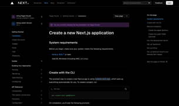 |
| 2 (Switch) | Open command line and create NextJS application | 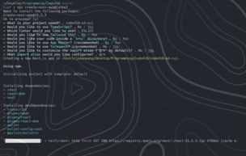 |
| 3 (Switch) | Open IDE | 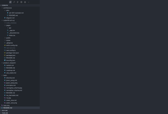 |
| 4 (Switch) | Search for component libraries on Reddit | 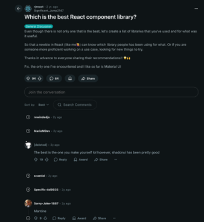 |
| 5  | Find Mantine setup instructions | 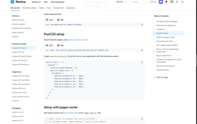 |
| 6 (Switch) | Install Mantine in NextJS app | 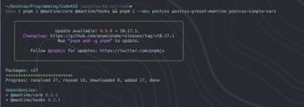 |
| 7 (Switch) | Use LLM to generate components and pages for dummy page | 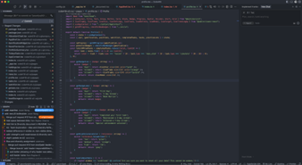 |
| 8 (Switch)  | Start development server to test front-end | 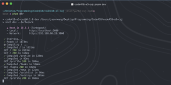 |
| 9 (Switch)  | Test front-end functionality by playing around in the browser |  |
| 10 (Switch) | Lint and check code for typescript errors | 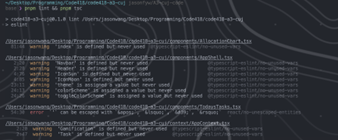 |
| 11 | Resolve linting errors | 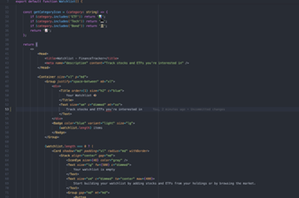 |
| 12 | Push code to repository | 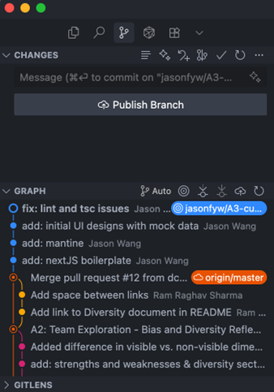 |
